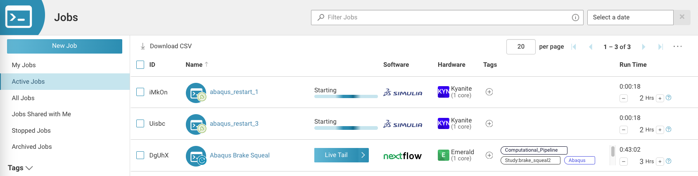

# Computational Pipelines with automatic Hardware Selection on Rescale

Author: [Robert Bitsche](mailto:rbitsche@rescale.com)

## Introduction

Simulation results are increasingly calculated in many steps by a chain of different programs 
that interact in complex ways. As a consequence, scientific workflow management systems are 
increasingly employed to effectively orchestrate these steps.

In this tutorial we demonstrate how the scientific workflow management system 
[Nextflow](https://www.nextflow.io/) can be used to orchestrate [Abaqus](https://www.3ds.com/products/simulia/abaqus) jobs on [Rescale](https://rescale.com). 
A very similar approach can be used to orchestrate other software or combinations of different software. 

The hardware the individual Abaqus jobs run on is not chosen by the user, but selected automatically 
based on the memory requirements of the Abaqus model.
This tutorial is meant as a simple example. Far more complicated workflows involving a variety of 
software and hardware configurations can be orchestrated using the same methods.

## Before getting started

Please make sure that:

* [Embedded Job API Keys](https://rescale.com/release-notes/embedded-job-api-keys-are-now-available/) are enabled.
* [High Performance Storage Devices](https://rescale.com/documentation/main-2/rescale-advanced-features/high-performance-storage/) are configured to use a stable mount path.

If you are unsure about these requirements, please contact your Customer Success Engineer, Account Executive or [Rescale Support](mailto:support@rescale.com).

## Introduction

We use the *Brake squeal analysis* example from the Abaqus *Example Problems*. 
To read about the example and download the required Abaqus input files, 
go to [User Guides](https://www.3ds.com/support/documentation/user-guides) on the Simulia website and select 
*SIMULIA Products*. 
At this point you may have to create a free account on the Simulia website.
After that go to: *Abaqus* > *Example Problems* > *Dynamic Stress/Displacement Analyses* > *Mode-based dynamic analyses* > *Brake squeal analysis* 
and download the input files:
* brake_squeal.inp
* brake_squeal_node.inp
* brake_squeal_elem.inp
* brake_squeal_res.inp

Please also download the files 
* [workflow.nf](workflow.nf)
* [processes.nf](processes.nf)
* [nextflow.config](nextflow.config)
* [suggest_hardware.py](suggest_hardware.py)
* [run_nextflow.sh](run_nextflow.sh)

from the current repository.

## Tutorial Steps

### Start a Storage Device

* Go to "Storage Devices" > "Create New Storage Device".  
* Give the storage device a name (e.g. "Computational Pipeline Test").  
* Choose coretype "Catseye", Cores: 1, and a suitable walltime limit (e.g. 1 days).  
* Choose a suitable storage size (e.g. 10 GB).  
* Click "Submit".  
* After a few minutes the storage device should show "Status: Started".

More details about the setup of a storage device can be found in the [documentation](https://rescale.com/documentation/main-2/rescale-advanced-features/high-performance-storage/).

### Parameterize the Model

We will analyze the model for varying coefficients of friction. 
Please copy the file `brake_squeal.inp` to `brake_squeal_template.inp`, 
open `brake_squeal_template.inp` using a text editor and replace the lines
```
*FRICTION
 0.3,
```
by
```
*FRICTION
<cof>,
```

Similarly, copy the file `brake_squeal_res.inp` to `brake_squeal_res_template.inp`, 
open `brake_squeal_res_template.inp` and replace the lines
```
*FRICTION
 0.5,
```
by
```
*FRICTION
<cof>,
```

### Create and Submit the Nextflow Control Job

Next, create a new job and give it a name (e.g. "Brake Squeal").

### Inputs

In the "Inputs" section click "Attach from Storage Device", select the storage device created in the previous step, 
click "Next" and click "Attach Storage Device Without Adding Files".

Add the following files by choosing "Upload from This Computer":
* brake_squeal_template.inp
* brake_squeal_res_template.inp
* brake_squeal_node.inp
* brake_squeal_elem.inp
* processes.nf
* workflow.nf
* nextflow.config
* suggest_hardware.py
* run_nextflow.sh

Your inputs section should now look like this:


### Software

In the Software section select the most recent available version of Nextflow, and use the 
following two lines as "Command":
```bash
export RUNNAME="brake_squeal"
./run_nextflow.sh
```

The `RUNNAME` defined above is used as the name of a directory on the storage device to which all files of the workflow are saved. 
If the directory already exists, it should be empty. If the directory does not exist, it is automatically created. 
The `RUNNAME` is also automatically added as a tag `Study:RUNNAME` to all worker jobs.


### Hardware Settings

In the "Hardware Settings" section, please select:
* Coretype: Emerald
* Cores: 1
* Walltime: a suitable walltime limit for the entire process (e.g. 3 hours)  
* Priority: Select "On Demand Priority".


### Submit

Submit the control job by clicking "Submit".

### Monitor the running Workflow

The workflow described by the file [workflow.nf](workflow.nf) is visualized in the graph below.
Five of the six processes in the graph are executed as individual Rescale jobs. 
The process "Auto-select Cloud Hardware" is executed inside the control job, as it does not require any relevant 
computational resources. 


After the control job has started you can use the Live Tailing feature to monitor the `process_output.log` file of the control job. 
In the screenshot below the processes `run_abaqus_datacheck`, `select_hardware` and `abaqus_1` have already been completed. 
The processes `abaqus_restart_1` and `abaqus_restart_3` are currently running in parallel. The process `abaqus_restart_2` is 
currently waiting, as the [nextflow.config](nextflow.config) file states that no more than 2 Abaqus jobs are allowed to run 
in parallel to limit the Abaqus license usage.


The `process_output.log` file also contains the following lines printed by the [suggest_hardware.py](suggest_hardware.py) script 
that is part of the `select_hardware` process:
```
INFO: Maximum memory estimate to minimise I/O in file brake_squeal_template_0.3.dat is 3397.0 MB.
INFO: Suggested coretype: {'code': 'kyanite', 'corecount': 1, 'memory': 8000}
```
As the model used here is very small, the automatic process selects the Kyanite coretype with a single CPU ("corecount"), 
as this choice provides sufficient memory (8000 MB) for the following Abaqus jobs.

The "Active Jobs" page shows the control job as well as all currently active worker jobs, as seen in the screenshot below.



## Download Result Files and shut down the Storage Device

The result files created on the storage device are copied back to the control job at the end of the 
workflow (see [run_nextflow.sh](run_nextflow.sh)). If the process worked flawlessly, it is not necessary to sync the 
files from the storage device back to cloud storage. You can therefore delete the directories created on the 
storage device (see screenshot below) before shutting down the storage device by clicking the "Stop" button.


Note that the output files contain two Nextflow HTML reports:
* nextflow_execution_report_yyyy-mm-dd_hhmmss.html
* nextflow_timeline_yyyy-mm-dd_hhmmss.html

A screenshot of the timeline report is shown below.


## How does it all work?

The file [processes.nf](processes.nf) defines four processes:
* run_abaqus_datacheck
* run_abaqus 
* run_abaqus_restart
* select_hardware 

Each process contains a "script" describing the actual process, and defines so-called input and output channels.

The file [workflow.nf](workflow.nf) uses the processes from [processes.nf](processes.nf) to describe a workflow. 

While the processes in [workflow.nf](workflow.nf) are called like functions:
```python
run_abaqus_datacheck(bs_template, bs_node, bs_elem, 0.3)
select_hardware(run_abaqus_datacheck.out.dat)
[...]
```
it is important to note that their execution order is *not* determined by the fact that the 
`select_hardware` process comes after the `run_abaqus_datacheck` process in the [workflow.nf](workflow.nf) file. 
It could also be written the other way around. 
Instead, the fact that an output channel of the `run_abaqus_datacheck` process (`run_abaqus_datacheck.out.dat`) 
is used as input for the `select_hardware` process determines the execution order. 

The script [suggest_hardware.py](suggest_hardware.py) reads the Abaqus dat-file created by the datacheck run, 
and extracts the "memory estimates to minimize I/O". It then suggests a coretype and a corecount (number of CPUs) 
based on the maximum memory required. The method implemented here is meant as a simple demonstration. The algorithm 
choosing the coretype and corecount could of course be much more sophisticated. It could, for example, automatically 
determine if the Abaqus model can be accelerated using GPUs, and select a GPU coretype if applicable.

The file [nextflow.config](nextflow.config) defines various options for the processes described above.

The following defines a `queueSize of 2 for all processes executed by the 'rescale-executor'.
```
executor {
    name = 'rescale-executor'
    queueSize = 2
}
```
As a consequence, no more than 2 Abaqus jobs are allowed to run in parallel to limit the Abaqus license usage.

The following configures the "select_hardware" process to run with the "local" executor, which means that the process will 
be executed inside the control job, as it does not require any relevant computational resources. 
```
process {
  withName: select_hardware {
    executor='local'
  }
```

The following code configures all processes labeled as "abaqus_job" to use the "rescale-executor", which means that 
these processes will be executed as individual Rescale jobs. It also selects the software ("abaqus"), 
software version ("2023-hf4"), walltime limit (2 hours), and priority ('INSTANT' for on-demand priority, 
'ON_DEMAND' for on-demand economy, 'RESERVED' for on-demand reserved).

The hardware ("machineType") and number of CPUs ("cpus") are not defined statically, but reference the variables 
"coretype_code" and "corecount", which are outputs of the `select_hardware` process.
```
  withLabel: abaqus_job {
    executor='rescale-executor'
    ext.jobAnalyses=[[
      analysisCode: "abaqus",
      analysisVersion: "2023-hf4",
      onDemandLicenseSeller: ["code":"rescale", "name":"Rescale"]
    ]]
    machineType={coretype_code}
    cpus={corecount}
    ext.wallTime=2
    ext.billingPriorityValue="INSTANT"
  }
```


